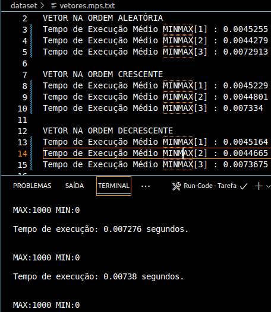

# MinMax
 <h1 align="center" font-size="200em"><b>Avaliação dos Algoritmos Minimax</b></h1>

## Introdução
<p align="justify">
  Este projeto em C++ foi desenvolvido para a disciplina de Algoritmos e Estruturas de Dados I e tem como objetivo simular e avaliar a eficiência de três algoritmos Minimax distintos. O foco é medir o tempo de execução de cada algoritmo e analisar sua eficiência com base nos conceitos de análise assintótica, que avalia o "custo" computacional de algoritmos, especialmente considerando a necessidade crescente de otimização no desenvolvimento de software.
</p>

## Objetivos
<p align="justify">
  O objetivo do programa é calcular o tempo de execução (em nanosegundos) de três algoritmos Minimax aplicados a vetores de inteiros. A eficiência de cada algoritmo será avaliada em três cenários de ordenação (aleatória, crescente e decrescente), com o processo sendo repetido 10 vezes para obter a média dos tempos. Os tamanhos dos vetores utilizados são: 1000, 10.000, 100.000 e 500.000, contendo números inteiros entre 0 e 1000.
</p>
<p align="justify">
  Verifica-se abaixo as três arquiteturas de códigos (Em Pascal) que devem ser adaptadas para o programa em C++:
  <p align="center">
  
  
  
  </p>
</p>

## Arquivos
### dataset
- ```vetores.mps.txt```: Contém os tempos de execução do programa.
- ```grafico.gp```: Script do gnuplot para gerar gráficos.
- ```dados[1...3].txt```: Resultados da execução em diferentes cenários de ordenação.
- ```grafico.png```: Gráfico gerado pelo gnuplot.
## src
- ```MinMax.hpp```: Declarações das funções MinMax.
- ```MinMax.cpp```: Implementação das funções MinMax e funções auxiliares.
- ```main.cpp```: Arquivo principal que executa o programa.

## Resolução do problema
<p align="justify">
  Antes de mais nada, quando refere-se a análise assintótica destas funções MinMax, tem-se essa tabela que reune o "gasto computacional" previsto em funções dos algoritmos representados, demonstrando no melhor caso, pior caso e no caso médio.
  <p align="center">
  
  </p>
Assim sendo tem-se o sistema abaixo contendo os arquivos citados acima além do objetivo de cada função:

- ```vector<int> GerarVetor(int n)```: Gera um vetor de tamanho n com valores aleatórios entre 0 e 1000.
- ```void organizarCrescente(vector<int> vec)```: Ordena o vetor de forma crescente.
- ```void organizarDecrescente(vector<int> vec)```: Ordena o vetor de forma decrescente.
- ```void printarVetor(const vector<int> vec)```: Imprime o vetor no terminal.
- ```void registrarVetor(const vector<int> vec, const string nomeArquivo)```: Grava os tempos de execução em um arquivo.
- ```double MinMax1(const vector<int> vec)```: Implementação do primeiro algoritmo MinMax.
- ```double MinMax2(const vector<int> vec)```: Implementação do segundo algoritmo MinMax.
- ```double MinMax3(const vector<int> vec)```: Implementação do terceiro algoritmo MinMax.
- ```double Media(const vector<int> vec,int opcao)```: Calcula a média dos tempos de execução de um dos algoritmos.
<p align="center">
  
  
  
  
  
  
  
  
</p>
  O programa gera os vetores, ordena-os de maneira crescente ou decrescente conforme necessário, e calcula o tempo de execução dos três algoritmos MinMax. Os tempos de execução são então registrados em arquivos para posterior análise gráfica.
  <br><br>Agora referindo-se aos casos de testes sugeridos, tem-se a tabela abaixo com a média de execução coletada durante os testes:
  <p align="center">
  
  </p>
<br><br>Como verificamos acima, os valores são dados em nanosegundos, possuindo uma variação coletada durante os testes. Como à exemplo, com o vetor de tamanho 1000 utilizando o "MinMax1" ordenado de modo aleatório demorou cerca de 9,7 * 10⁻⁶ nanosegundos, com uma abertura de mais ou menos 0,3 * 10⁻⁶. Durante a execução, o terminal demonstra o vetor e os valores mínimos e máximos enquanto o arquivo demonstra o tempo, como mostrado abaixo:
  <p align="center">
  
  </p>
Assim sendo, utilizando da linguagem gnuplot para criarmos os gráficos a partir do "pior resultado" de cada um dos casos vistos na tabela, observe o codigo para compilação abaixo e como ele deve ser compilado no terminal (obs: você deve abrir a pasta do arquivo no terminal):
  <p align="center">
  
  </p>
Além disso esses são os dados analisados, separados por arquivos que representam como o vetor estava organizado:
  <p align="center">
  
  </p>
Tem-se esses três gráficos do tempo de execução pelo tamanho do vetor, separados pela maneira como o vetor está ordenado:
<table>
    <tr>
       <td></td>
       <td></td>
       <td></td>
    </tr>
</table>
<br>Nota-se um maior intervalo de execução provindo do "MinMax3" apesar de seu desempenho ser teoricamente o mais "otimizado" relativo a execução das funções. Agora observando os MinManx1 e MinMax2 percebe-se uma curva muito semelhante, muitas vezes quase imperceptível quando se trata de grande valores. Porém ao se aproximar do mesmo, principalmente nos vetores de maior números, tem-se o veredito de que o MinMax2 apresenta a melhor constância de valores e maior otimização quanto a tempo de execução. Isso fica principalmente vísivel quando o vetor esta ordenado crescentemente, demonstrando a real queda de otimização do MinMax1. Observe abaixo a junção de todos os gráficos vistos acima:
  <p align="center">
  
  </p>
</p>


## Conclusão
<p align="justify">
  Com base nos resultados, observamos que, apesar do algoritmo MinMax3 teoricamente ser mais eficiente, ele apresentou a maior variação no tempo de execução. O MinMax2 demonstrou a maior consistência, especialmente em vetores grandes e com ordenação crescente, tornando-se o mais eficiente em termos de tempo de execução.
  Diversos fatores, como especificações da máquina, repetição de valores no vetor e o sistema operacional, podem influenciar os resultados. Portanto, é importante considerar esses fatores ao analisar o desempenho de algoritmos, especialmente em cenários de grande volume de dados.
</p>

## Referências
DA SILVA, Michel Pires. Material de aula: Análise Assintótica. 2024. Disponível em: <https://ava.cefetmg.br/pluginfile.php/250215/mod_resource/content/8/Aula1.pdf>


## Compilação e execução
* | Comando                |  Função                                                                                           |                     
  | -----------------------| ------------------------------------------------------------------------------------------------- |
  |  `make clean`          | Apaga a última compilação realizada contida na pasta build                                        |
  |  `make`                | Executa a compilação do programa utilizando o gcc, e o resultado vai para a pasta build           |
  |  `make run`            | Executa o programa da pasta build após a realização da compilação                                 |

## Contato

✉️ <i>pedroaugustomoura70927@gmail.com</i>
</a>

